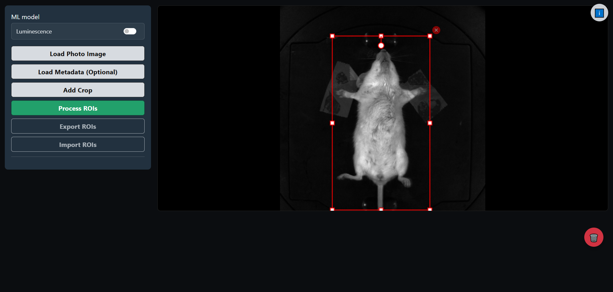
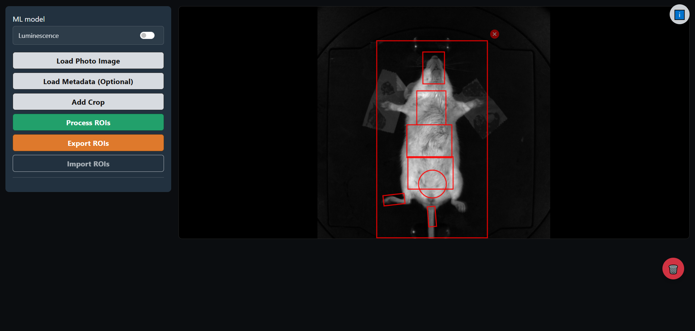
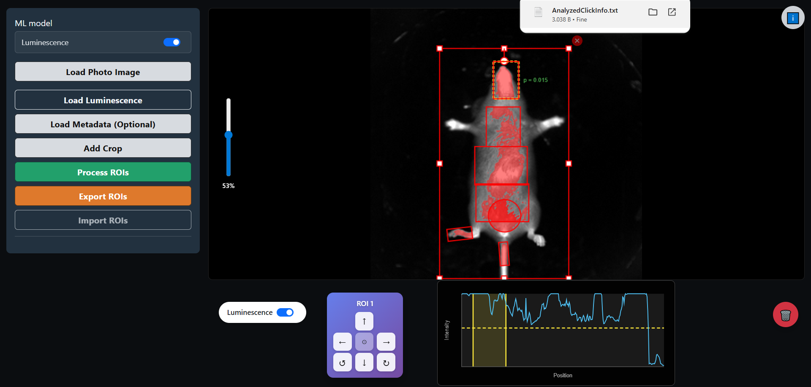

---
hide:
  - toc
---

# Example

A step-by-step walkthrough of a typical workflow with screenshots.

---

## 1. Load the Image

Open the application and click **Load Photo Image** to select your TIFF file.

{width="600"}

---

## 2. Add Crops

Click **Add Crop** to create a bounding box around each mouse.

{width="600"}

---

## 3. Adjust the Crop

Resize and position the crop to fit the mouse. Use the corner handles to resize and the circular handle to rotate.

{width="600"}

---

## 4. Process ROIs

Click **Process ROIs** to run the prediction model.

{width="600"}

---

## 5. Review Predictions

The model outputs 7 ROIs per mouse. Click on any ROI to select and adjust it.

{width="600"}

---

## 6. Load Luminescence (Optional)

For dual-input analysis, enable the **Luminescence** model switch and load the fluorescence image.

{width="600"}

---

## 7. Analyze Signal

Switch to luminescence view and adjust the threshold slider to highlight relevant pixels.

{width="600"}

---

## 8. Export Results

Click **Export ROIs** to download the results in a format compatible with the imaging system.

{width="600"}